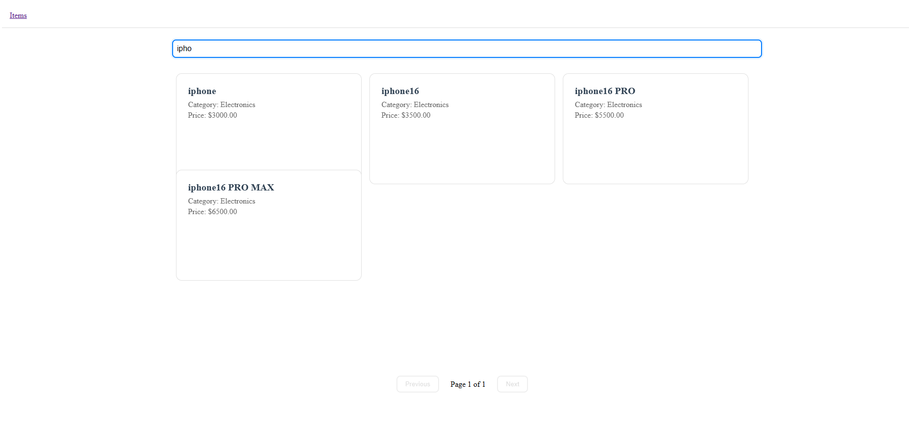

<h1 align="center">
    
</h1>

<h1 align="center">
   🙂 <a href="#"> Take‑Home Assessment </a>
</h1>

<h3 align="center">
    Welcome, candidate! This project contains intentional issues that mimic real‑world scenarios. Your task is to refactor, optimize, and fix these problems.
</h3>

<p align="center">
  

  

  <a href="https://github.com/jhonatheberson/easy-church/releases">
        
  </a>
  <a href="https://github.com/jhonatheberson/challenge-bitgesell/commits/master">
    
  </a>

   
   <a href="https://github.com/jhonatheberson/challenge-bitgesell/stargazers">
    
  </a>

  <a href="https://github.com/jhonatheberson">
    
  </a>

  <!-- <a href="https://blog.rocketseat.com.br/">
    
    </a>  -->
</p>

<h4 align="center">
  Status: development
    <!-- Status: Finished -->
</h4>

<p align="center">
 <a href="#about">About</a> •
 <a href="#features">Features</a> •
 <a href="#layout">Layout</a> •
 <a href="#how-it-works">How it works</a> •
 <a href="#tech-stack">Tech Stack</a> •
 <a href="#contributors">Contributors</a> •
 <a href="#author">Author</a> •
 <a href="#user-content-license">License</a>

</p>

## About

🌌 Welcome, candidate! This project contains intentional issues that mimic real‑world scenarios. Your task is to refactor, optimize, and fix these problems.

---

## Features

- [x]  Backend (Node.js):

  - [x] Refactor blocking I/O
  - [x] Performance
  - [x] Testing

- [x] Frontend (React):

  - [x] Memory Leak
  - [ ] Pagination & Search
  - [ ] Performance
  - [ ] UI/UX Polish

---

### Web

<p align="center" style="display: flex; align-items: flex-start; justify-content: center;">
  
</p>

## How it works

This project is divided into two parts:

1. Backend (server folder)
2. Frontend (web folder)

Both Frontend and Mobile need the Backend to be running to work.

### Pre-requisites

Before you begin, you will need to have the following tools installed on your machine:
[Git](https://git-scm.com), [Node.js](https://nodejs.org/en/).
In addition, it is good to have an editor to work with the code like [VSCode](https://code.visualstudio.com/)

## Running with Docker Compose

```bash
# Build and start all services
$ docker compose up -d

# View logs
$ docker compose logs -f

# Stop all services
$ docker compose down

# Rebuild and restart services
$ docker compose up -d --build
```

The Docker Compose setup includes:

- Backend API (Node.js)
- Frontend (React)
- Redis (for caching)

Services will be available at:

- Frontend: <http://localhost:3000>
- Backend API: <http://localhost:3001>
- Redis: localhost:6379

#### Rodando o Backend (servidor)

```bash

# Clone this repository
$ git clone git@github.com:jhonatheberson/challenge-bitgesell.git

# Access the project folder cmd/terminal
$ cd challenge-bitgesel

# install the dependencies ths .eslint
$ npm install

# go to the server folder
$ cd backend

# install the dependencies
$ npm install

# Run the application in development mode
$ npm start

# The server will start at port: 3001 - go to http://localhost:3001

```

<p align="center">
  <a href="https://github.com/jhonatheberson/challenge-bitgesell/blob/master/Insomnia_API_Ecoletajson.json" target="_blank"></a>
</p>

#### Running the web application (Frontend)

```bash

# Clone this repository
$ git clone git@github.com:jhonatheberson/challenge-bitgesell.git

# Access the project folder in your terminal
$ cd challenge-bitgesel

# Go to the Front End application folder
$ cd frontend

# Install the dependencies
$ npm install

# Run the application in development mode
$ npm start

# The application will open on the port: 3000 - go to http://localhost:3000

```

## Running Tests

### Backend Tests

```bash
# Go to the backend folder
$ cd backend

# Run all tests
$ npm test

# Run tests with coverage
$ npm test -- --coverage

# Run tests in watch mode (useful during development)
$ npm test -- --watch
```

## Objectives

### 🔧 Backend (Node.js)

1. **Refactor blocking I/O**
   - `src/routes/items.js` uses `fs.readFileSync`. Replace with non‑blocking async operations.

2. **Performance**
   - `GET /api/stats` recalculates stats on every request. Cache results, watch file changes, or introduce a smarter strategy.

3. **Testing**
   - Add **unit tests** (Jest) for items routes (happy path + error cases).

### 💻 Frontend (React)

1. **Memory Leak**
   - `Items.js` leaks memory if the component unmounts before fetch completes. Fix it.

2. **Pagination & Search**
   - Implement paginated list with server‑side search (`q` param). Contribute to both client and server.

3. **Performance**
   - The list can grow large. Integrate **virtualization** (e.g., `react-window`) to keep UI smooth.

4. **UI/UX Polish**
   - Feel free to enhance styling, accessibility, and add loading/skeleton states.

### 📦 What We Expect

- Idiomatic, clean code with comments where necessary.
- Solid error handling and edge‑case consideration.
- Tests that pass via `npm test` in both frontend and backend.
- A brief `SOLUTION.md` describing **your approach and trade‑offs**.

## Quick Start

node version: 18.XX

```bash
nvm install 18
nvm use 18

# Terminal 1
cd backend
npm install
npm start

# Terminal 2
cd frontend
npm install
npm start
```

> The frontend proxies `/api` requests to `http://localhost:3001`.
